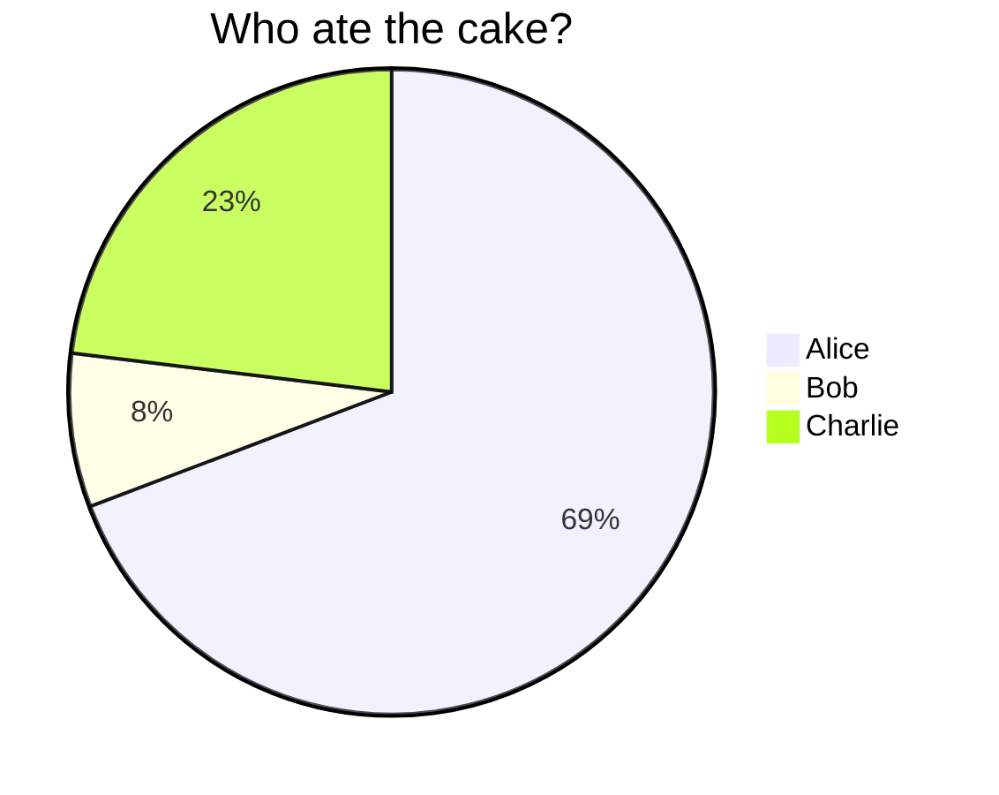
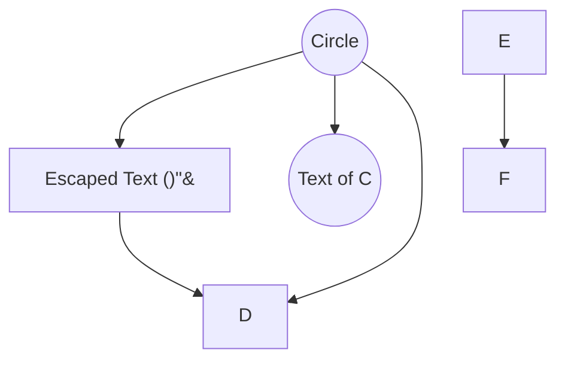
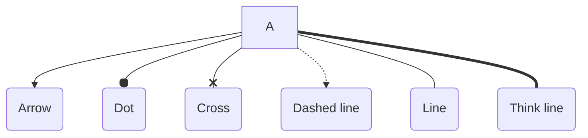
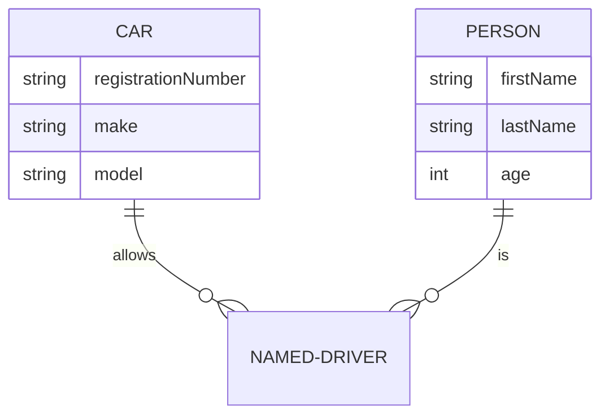

[Markdown cheat sheet](https://github.com/adam-p/markdown-here/wiki/Markdown-Cheatsheet)

[Mermaid](https://mermaid-js.github.io/mermaid/#/): graphs in markdown

If you're reading this on github and they still haven't implemented mermaid support,
consider installing [one of these extensions](https://chrome.google.com/webstore/search/mermaid%20diagram).

## Pie chart

## Flowchart

## Various line types

## ERD

